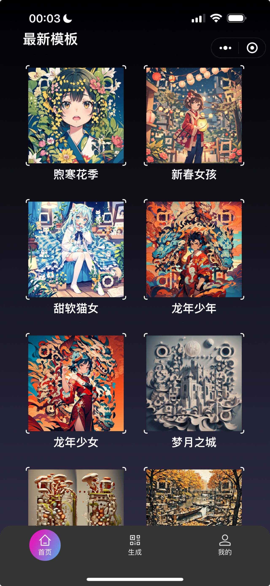

# Text2QR: Harmonizing Aesthetic Customization and Scanning Robustness for Text-Guided QR Code Generation [:link:](https://openaccess.thecvf.com/content/CVPR2024/html/Wu_Text2QR_Harmonizing_Aesthetic_Customization_and_Scanning_Robustness_for_Text-Guided_QR_CVPR_2024_paper.html)  [🏠](https://mulns.github.io/Text2QR/)

[Guangyang Wu](https://scholar.google.com/citations?user=lgBxzzcAAAAJ&hl=en),
[Xiaohong Liu](https://scholar.google.com/citations?user=Tq2hoMQAAAAJ&hl=en),
[Jun Jia]()
[Xuehao Cui]()
[Guangtao Zhai]()

*Shanghai Jiao Tong University*

**In CVPR 2024**


In the digital era, QR codes serve as a linchpin connecting virtual and physical realms. Their pervasive integration across various applications highlights the demand for aesthetically pleasing codes without compromised scannability. However, prevailing methods grapple with the intrinsic challenge of balancing customization and scannability. Notably, stable-diffusion models have ushered in an epoch of high-quality, customizable content generation. This paper introduces Text2QR, a pioneering approach leveraging these advancements to address a fundamental challenge: concurrently achieving user-defined aesthetics and scanning robustness. To ensure stable generation of aesthetic QR codes, we introduce the QR Aesthetic Blueprint (QAB) module, generating a blueprint image exerting control over the entire generation process. Subsequently, the Scannability Enhancing Latent Refinement (SELR) process refines the output iteratively in the latent space, enhancing scanning robustness. This approach harnesses the potent generation capabilities of stable-diffusion models, navigating the trade-off between image aesthetics and QR code scannability. Our experiments demonstrate the seamless fusion of visual appeal with the practical utility of aesthetic QR codes, markedly outperforming prior methods.

## :fire: Results

> Compared with previous methods, our Text2QR outperforms by large margin.

## 🔍 Method


> Overall Structure of the Text2QR. The pipeline consists of three stages, denoted with orange, blue and black lines. We propose the QAB module for generating a blueprint image used as controlling guidance, and propose the SELR module for refining the controlled output to enhance its scanning robustness.

## 📢 News

2024-6-13: Added WeChat Applet. 

2024-6-13: Added arXiv version: <a href="https://arxiv.org/abs/2403.06452"></a>. 

## 💬 WeChat Applet
We provide a WeChat Applet for generating customized QR code using Text2QR. Here are some screenshots of the applet. Please use WeChat to scan the QR Code below to enter the applet.
| | | |
|:-------------------------:|:-------------------------:|:-------------------------:|
| |  | SCAN ME~|

## 🎓 Citation

Please cite our paper:

```bibtex
@InProceedings{Wu_2024_CVPR,
    author    = {Wu, Guangyang and Liu, Xiaohong and Jia, Jun and Cui, Xuehao and Zhai, Guangtao},
    title     = {Text2QR: Harmonizing Aesthetic Customization and Scanning Robustness for Text-Guided QR Code Generation},
    booktitle = {Proceedings of the IEEE/CVF Conference on Computer Vision and Pattern Recognition (CVPR)},
    month     = {June},
    year      = {2024},
    pages     = {8456-8465}
}
```
